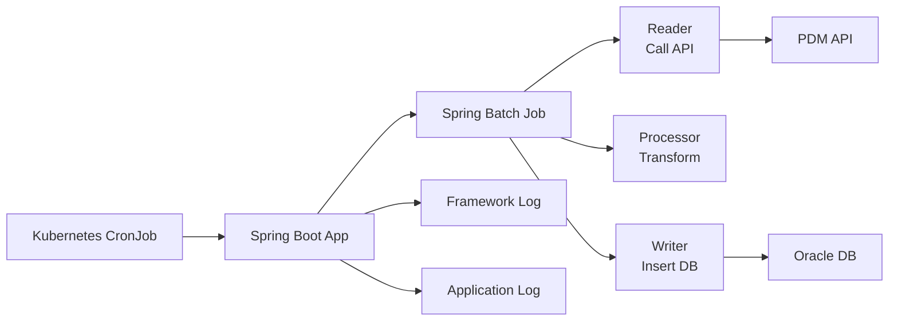
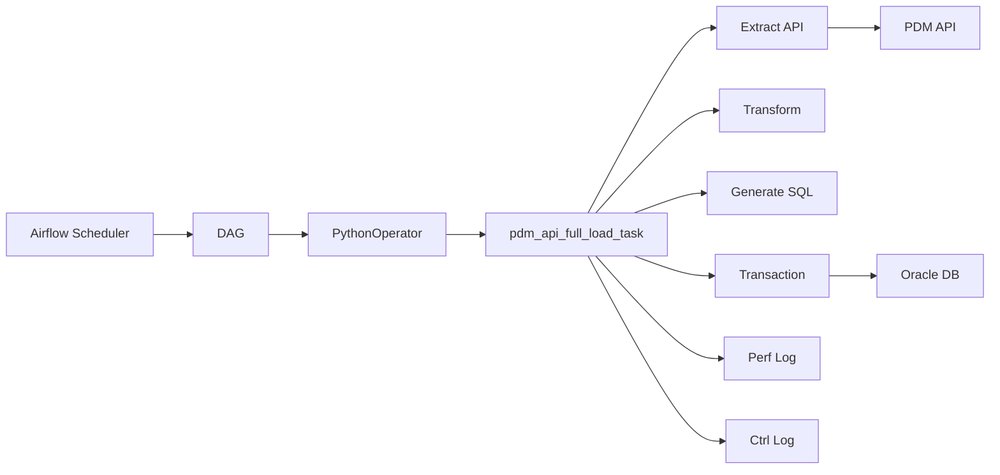
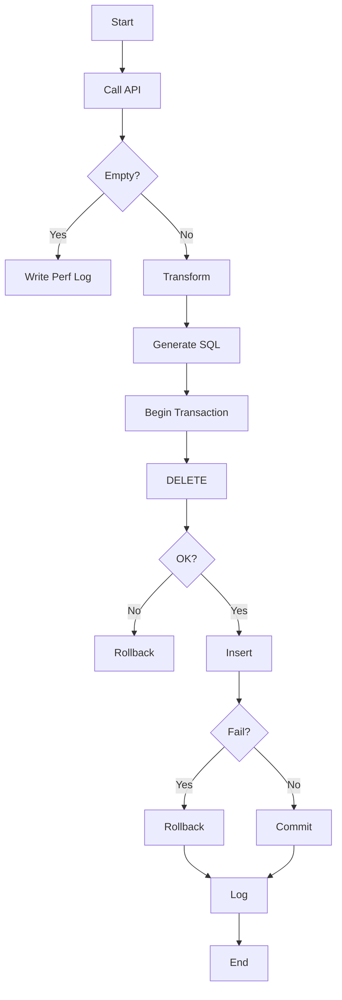

# 1. 任務描述（Objective）

本次任務目標為將既有 `PQO-PDMEtl` 系統中的 ETL 流程，  
由「應用程式導向（Spring Batch）」轉型為「排程導向（Airflow DAG）」，  
以解決現有系統在**維護成本、可觀測性與架構複雜度**上的問題。

---

本次任務範圍包含以下三個 ETL：

- `TI_PROC_OPT`
    
- `TI_RAW_WAFER_QUES`
    
- `TI_WF_OPT_CATG`
    

資料來源為 **PDM API**，並同步至 **Oracle DB**。

---

## 1.1 ETL 流程概念

```text
PDM API → Transform → Oracle DB
```

---

# 2. 原有系統設計（Spring Batch）

### 架構說明  
  
本專案採用典型 Spring Batch 分層設計：  
  
- `batch/`：ETL 核心流程（Reader / Processor / Writer）  
- `model/`：資料模型（JPA Entity / DTO）  
- `repository/`：資料庫操作（DAO）  
- `config/`：系統與資料來源設定  
- `PqoPdmEtlApplication`：應用程式入口  
  
👉 每一個 ETL 任務（例如 TI_PROC_OPT）皆需實作：  
  
- Reader  
- Processor  
- Writer  
  
並由 BatchConfig 組裝成 Job。

``` text
src/main/java/com/tsmc/pqo/etl/cis/
├── batch/
│   ├── BatchConfig.java
│   ├── BatchDataSourceConfig.java
│   ├── JobCompletionNotificationListener.java
│   ├── TiProcOptProcessor.java
│   ├── TiProcOptReader.java
│   ├── TiProcOptWriter.java
│   ├── TiRawWaferQuesProcessor.java
│   ├── TiRawWaferQuesReader.java
│   ├── TiRawWaferQuesWriter.java
│   ├── TiWfOptCatgProcessor.java
│   ├── TiWfOptCatgReader.java
│   └── TiWfOptCatgWriter.java
├── model/
│   ├── jpa/
│   │   ├── TiProcOpt.java
│   │   ├── TiRawWaferQues.java
│   │   ├── TiRawWaferQuesPK.java
│   │   ├── TiWfOptCatg.java
│   │   └── TiWfOptCatgPK.java
│   └── to/
│       ├── TiProcOptTo.java
│       ├── TiRawWaferQuesTo.java
│       └── TiWfOptCatgTo.java
├── repository/
│   ├── TiProcOptDao.java
│   ├── TiRawWaferQuesDao.java
│   └── TiWfOptCatgDao.java
├── PDMConfig.java
├── PQOConfig.java
└── PqoPdmEtlApplication.java
```

---

## 2.2 架構圖




---

## 2.3 執行流程

1. CronJob 觸發
    
2. 啟動 Spring Boot
    
3. 執行 Batch Job
    
4. 完成 ETL
    
5. 結束程式
    

---

## 2.4 Spring Batch 特性

Spring Batch 主要設計用於「大批次資料處理」，其核心能力包括：

- chunk-based transaction（分批 commit）
- retry / skip 機制（容錯處理）
- 適用於大量資料與長時間執行任務

---

### 2.4.1 Chunk-based Transaction（分批提交）

Spring Batch 預設以 **chunk** 為單位處理資料，例如：

```
stepBuilderFactory.get("step")
    .<Input, Output>chunk(100)
    .reader(reader)
    .processor(processor)
    .writer(writer)
    .build();
```

---

#### 執行概念

```
讀100筆 → 處理100筆 → 寫入100筆 → commit
讀100筆 → 處理100筆 → 寫入100筆 → commit
...
```

---

#### 設計目的

- 避免單一 transaction 過大
- 降低記憶體使用
- 發生錯誤時只需 rollback 當前 chunk

---

### 2.4.2 Retry / Skip 機制（容錯處理）

Spring Batch 提供 fault-tolerant 機制，可針對單筆資料進行 retry 或 skip：

```
stepBuilderFactory.get("step")
    .<Input, Output>chunk(100)
    .reader(reader)
    .processor(processor)
    .writer(writer)
    .faultTolerant()
    .retry(Exception.class)
    .retryLimit(3)
    .skip(Exception.class)
    .skipLimit(10)
    .build();
```

---

### 各設定說明

#### `faultTolerant()`

啟用容錯模式（fault-tolerant mode）

👉 如果沒有這行：

- 發生 exception → 整個 Step fail

👉 有這行：

- 可以搭配 retry / skip 做細粒度控制

---

#### `retry(Exception.class)`

指定「哪些例外可以重試」

👉 表示：

- 當發生 Exception 時，允許 retry

---

#### `retryLimit(3)`

設定最大重試次數

👉 行為：

失敗 → retry 第1次  
失敗 → retry 第2次  
失敗 → retry 第3次  
還失敗 → 判定為失敗

---

#### `skip(Exception.class)`

指定「哪些例外可以跳過」

👉 表示：

- 該筆資料失敗時，可以忽略並繼續處理下一筆

---

#### `skipLimit(10)`

最多允許 skip 幾筆資料

👉 行為：

- 若失敗筆數 ≤ 10 → 繼續
- 若超過 → 整個 Step fail

---

### 整體行為總結

當某筆資料處理失敗時：

1. 先 retry（最多 3 次）
2. 若仍失敗 → skip 該筆
3. 若累計 skip 超過 10 筆 → job fail

---

然而在本專案中：  
  
- 未啟用 fault-tolerant 設定  
- 採用「整批成功或整批 rollback」策略  
- 資料量小（<100 筆）  
  
因此未使用 retry / skip 機制。

---

### 2.4.3 本專案實際情境

本專案 ETL 流程如下：

```
Call API → Transform → Insert DB
```

---

### 特性

- 每次資料量 < 100 筆
- 單次 API 呼叫即可取得全部資料
- 採用「全成功或全 rollback」策略
- 無需 parallel / partition

---

### 2.4.4 差異分析

| Spring Batch 能力  | 本專案需求             |
| ---------------- | ----------------- |
| chunk 分批 commit  | 單一 transaction 即可 |
| retry / skip（逐筆） | 採整批 rollback      |
| 大量資料處理           | 小量資料（<100 筆）      |

---

### 2.4.5 結論
  
Spring Batch 提供的核心能力，在本專案中幾乎未被使用。  
  
同時，由於框架設計採用 Reader / Processor / Writer 分層模式，  
  
在本專案「小資料量、簡單流程」的情境下：  
  
- 增加了不必要的 class 拆分  
- 提高了開發與理解成本  
- 導致架構複雜度高於實際需求  

---

# 3. 重構動機與目標  
  
## 3.1 問題與本質分析  
  
在現有 Spring Batch 架構下，觀察到以下問題：  
  
---  
  
### (1) 架構與需求不匹配  
  
本專案 ETL 流程為：  

Call API → Transform → Insert DB

  
但實際採用的是為「大型批次處理」設計的 Spring Batch（chunk / partition / retry）。  
  
👉 導致：  
  
- 一個 ETL 流程需拆分為 Reader / Processor / Writer 多個 class    
- 增加開發與維護成本    
- 架構複雜度高於實際需求    
  
---  
  
### (2) Log 冗餘與可觀測性不足  
  
- framework log 與 application log 混雜    
- 缺乏統一的監控與 UI    
  
👉 導致：  
  
- 錯誤難以快速定位    
- troubleshooting 成本高    
  
---  
  
### (3) 維護成本與技術負擔  
  
系統依賴 Spring Boot 生態：  
  
- Spring Batch / JPA / JDBC 等多項 dependency    
- 升版需處理相依衝突    
- CI pipeline 容易出現問題    
  
👉 問題本質：  
  
> ETL 任務被包在「應用程式框架」中  
  
---  
  
### (4) 排程與業務邏輯分離：彈性與維運成本的取捨  
  
目前架構中：  
  
- 排程定義於 Kubernetes CronJob  
- ETL 邏輯實作於 Spring Boot application  
  
此設計的優點是：  
  
- 若僅需調整排程週期，可只修改 CronJob 設定  
- 無需重新 build application 或重新執行 CI  
  
然而，其代價在於：  
  
- 排程與執行邏輯分散於不同元件  
- 問題排查需同時檢查 CronJob、Pod、Application 與 Batch Job  
- 任務狀態、retry 與 log 缺乏統一檢視介面  
  
因此，對一般服務型系統而言，排程與邏輯分離具有一定彈性；  
但對 ETL 任務而言，將排程、執行、retry 與監控整合到 Airflow 中，通常更有利於維運與觀測。
  
---  
  
## 3.2 核心轉變  
  
### Before  

CronJob → Spring Boot → Batch → DB
  
👉 ETL 是「應用程式的一部分」  
  
---  
  
### After  

Airflow DAG → Task → DB
  
👉 ETL 是「排程系統中的任務」  
  
---  
  
## 3.3 為什麼選擇 Airflow  
  
Airflow 作為 workflow orchestration engine，具備：  
  
- DAG 可直接表達 ETL 流程    
- 內建 scheduling / retry / monitoring    
- UI 可觀察任務狀態    
- 與 ETL 任務高度契合    
  
---  
  
## 3.4 改動目標  
  
| 目標 | 說明 |  
|------|------|  
| 降低維護成本 | 移除 Spring Boot 生態依賴 |  
| 提升可觀測性 | Airflow UI + 統一 log |  
| 簡化架構 | 移除過度 abstraction |  
| 統一排程管理 | 集中至 Airflow DAG |  
| 提升開發效率 | ETL 流程 function 化 |  
  
---  
  
## 3.5 關鍵結論  
  
本次重構的本質為：  
  
> 從「依賴框架的應用程式」    
> → 「由排程驅動的資料處理流程」

---

# 4. 新系統架構（Airflow）

## 4.1 架構圖



---

## 4.2 ETL 流程



---

## 4.3 專案結構

app/  
└── dags/  
    ├── etl_ti_proc_opt.py  
    ├── etl_ti_raw_wafer_ques.py  
    ├── etl_ti_wf_opt_catg.py  
    ├── pdm_api_etl_utils/  
    │   ├── pdm_api_full_load.py  
    │   ├── sql_utils.py  
    │   └── __init__.py  
    ├── schemas.py  
    ├── utils.py  
    └── __init__.py

### 架構說明

本次重構後的 Airflow 專案，採用「**DAG 定義 + 共用 ETL framework**」的方式設計：

- `etl_ti_proc_opt.py`  
    定義 `TI_PROC_OPT` 的 DAG，包含排程設定、task 定義與對應的轉換 / SQL 組裝邏輯
- `etl_ti_raw_wafer_ques.py`  
    定義 `TI_RAW_WAFER_QUES` 的 DAG
- `etl_ti_wf_opt_catg.py`  
    定義 `TI_WF_OPT_CATG` 的 DAG
- `pdm_api_etl_utils/pdm_api_full_load.py`  
    ETL 核心流程，負責：
    - 呼叫 PDM API
    - 執行 transform
    - 產生 SQL
    - 控制 transaction
    - 寫入 logging table
- `pdm_api_etl_utils/sql_utils.py`  
    SQL 相關共用工具，負責將 Python / pandas 值轉換為可執行的 SQL 字串格式
- `schemas.py`  
    定義 ETL control log 與 performance log 所需的資料結構
- `utils.py`  
    提供共用工具函式，例如：
    - Oracle 查詢
    - SQL batch execution
    - ETL log 寫入
    - SQL error code parsing

---

# 5. 核心設計亮點

## 5.1 ETL Framework 化

`pdm_api_full_load_task()`

👉 抽象：

- Extract
    
- Transform
    
- Load
    
- Logging
    

---

## 5.2 Transaction 一致性

DELETE + INSERT → single TX

---

## 5.3 Logging

- PERF LOG
    
- CTRL LOG
    

---

## 5.4 Retry

Airflow built-in

---

## 5.5 DAG 設計

一表一 DAG → 可獨立 rerun

---

# 6. Trade-off

### SQL

row-by-row（因資料量小）

---

### Full Load

DELETE（支援 rollback）

---

# 7. 成效

|項目|Spring Batch|Airflow|
|---|---|---|
|複雜度|高|低|
|維護成本|高|低|
|觀測性|低|高|
|排程|分散|集中|

---

# 8. Future Work

- batch insert
    
- data guard
    
- DAG 拆分
    
- alert
    

---

# 9. 結論

本次重構成功將 ETL 系統由：

Spring Batch（重量級應用）  
→ Airflow DAG（輕量排程架構）

---

## 帶來的效益

- 降低維護成本
- 提升可觀測性
- 強化資料一致性
- 提升開發與擴展效率
