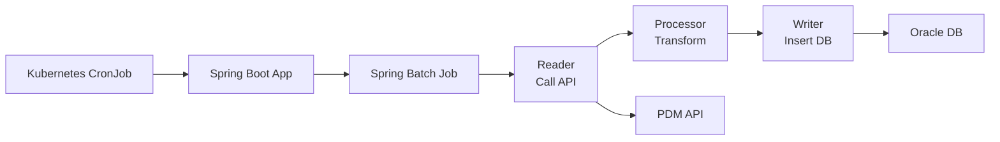
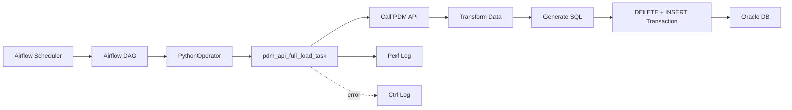

# 1. 背景與任務目標

本次任務的目標，是將既有 `PQO-PDMEtl` 系統中的 ETL 流程，  
由原本的 **Spring Batch 應用**，重構為 `PQO-batch` repository 中的 **Airflow DAG 任務**。

此次重構的核心，不只是語言從 Java 轉為 Python，
而是將 ETL 的執行模式由：

```text
應用程式導向（Application-oriented）
```

轉為：

```text
排程導向（Workflow-oriented）
```

也就是將 ETL 從一個需獨立部署與維護的 Spring Boot 批次程式，  
轉型為 Airflow 中可被排程、監控、重試與管理的資料處理流程。

---

## 1.1 任務範圍

本次重構任務主要涵蓋以下三張目標表的 ETL：

- `TI_PROC_OPT`
- `TI_RAW_WAFER_QUES`
- `TI_WF_OPT_CATG`
    
資料來源皆為 **PDM API**，目標端為 **Oracle DB**。

---

## 1.2 ETL 流程概念

```text
PDM API → Transform → Oracle DB
```

本次 ETL 的共同特性如下：

- 每次由 API 全量取得資料
- 資料量小(~100筆)
- 採 Full Load 策略
- 目標為整批成功或整批 rollback

---

## 1.3 本次分享重點

本次分享將說明以下內容：

- 原有 Spring Batch 架構與限制
- 重構動機與目標
- Airflow DAG 新架構與核心實作方式
- 重構後的效益與 trade-off

---

# 2. 原有系統設計（Spring Batch）

原系統 `PQO-PDMEtl` 為一個 Spring Boot + Spring Batch 專案，  
由 Kubernetes CronJob 定時啟動容器並執行 ETL。

整體流程如下：

```text
Kubernetes CronJob → Spring Boot App → Spring Batch → Oracle DB
```

也就是說，原本的 ETL 是包在一個 Spring Boot application 裡面執行，
比較像是一個「被排程啟動的應用程式」。

---

## 2.1 專案結構

```text
src/main/java/com/tsmc/pqo/etl/cis/
├── batch/
│   ├── BatchConfig.java
│   ├── BatchDataSourceConfig.java
│   ├── JobCompletionNotificationListener.java
│   ├── TiProcOptProcessor.java
│   ├── TiProcOptReader.java
│   ├── TiProcOptWriter.java
│   ├── TiRawWaferQuesProcessor.java
│   ├── TiRawWaferQuesReader.java
│   ├── TiRawWaferQuesWriter.java
│   ├── TiWfOptCatgProcessor.java
│   ├── TiWfOptCatgReader.java
│   └── TiWfOptCatgWriter.java
├── model/
│   ├── jpa/
│   │   ├── TiProcOpt.java
│   │   ├── TiRawWaferQues.java
│   │   ├── TiRawWaferQuesPK.java
│   │   ├── TiWfOptCatg.java
│   │   └── TiWfOptCatgPK.java
│   └── to/
│       ├── TiProcOptTo.java
│       ├── TiRawWaferQuesTo.java
│       └── TiWfOptCatgTo.java
├── repository/
│   ├── TiProcOptDao.java
│   ├── TiRawWaferQuesDao.java
│   └── TiWfOptCatgDao.java
├── PDMConfig.java
├── PQOConfig.java
└── PqoPdmEtlApplication.java
```

從專案結構可以看出，原系統為典型 Spring Batch 分層設計：  
  
- `batch/`：定義 Batch Job / Step，以及各表對應的 Reader、Processor、Writer  
- `model/jpa/`：定義寫入 Oracle DB 的 JPA Entity  
- `model/to/`：定義從 PDM API 接收資料的 Transfer Object  
- `repository/`：定義各表對應的資料存取介面  
- `PDMConfig.java` / `PQOConfig.java`：負責外部 API 與資料庫相關設定  
- `PqoPdmEtlApplication.java`：Spring Boot application 入口

也就是說，即使實際 ETL 流程本身相對單純，仍需要透過多個 framework layer 與 class 共同組成。

---

## 2.2 Spring Batch 分層模式與實作成本

在 Spring Batch 架構中，一個 ETL 通常會被拆分為 Reader、Processor、Writer，並由 BatchConfig 組裝成 Step 與 Job。  
  
以 `TI_PROC_OPT` 為例，原系統需要至少包含：  
  
- `TiProcOptReader`：呼叫 PDM API 取得資料  
- `TiProcOptProcessor`：進行欄位轉換與資料清洗  
- `TiProcOptWriter`：透過 DAO / JPA repository 寫入 Oracle  
- `BatchConfig`：組裝 Step 與 Job  
  
這樣的分層模式在大型批次任務中有助於責任切分與擴充；  
但對本專案這類相對單純的 ETL 而言，也代表需要額外維護多個 class 與 framework 組裝設定。

---

## 2.3 原系統架構圖




---

## 2.4 原系統執行方式  
  
從 runtime 角度來看，原系統的執行流程如下：
  
1. **Kubernetes CronJob 觸發**  
由 `cronjob.yaml` 定義排程時間，並透過 `java -jar` 啟動 `PQO-PDMETl.jar`  
  
2. **Spring Boot 啟動 Application Context**  
由 `PqoPdmEtlApplication.java` 作為入口，載入整個 Spring application  
  
3. **初始化外部資源與 Batch 元件**  
   Spring Boot 會建立所需的 API client、DB connection、transaction manager，以及 Spring Batch Job / Step / Reader / Processor / Writer 等相關元件
  
4. **執行 Spring Batch Job**  
依 `BatchConfig.java` 中定義的 Step 流程執行 Reader → Processor → Writer  
  
5. **Job 完成後記錄狀態並結束程式**  
由 `JobCompletionNotificationListener.java` 在 Job 結束後記錄完成或失敗狀態

整個 ETL 的執行，需要先啟動完整的 Spring Boot 應用，
而不是 Airflow 裡可以直接管理的一個 workflow task。

### 2.4.1 Job 執行模式  
  
在原 Spring Batch 架構中，系統中定義了多個 Job（對應不同 ETL 任務）。  
當 Spring Boot 啟動時，這些 Job 會由 Spring Batch 自動執行。  
  
- 在原設計中，Job 之間為**同步（非平行）執行**  
- 執行順序由 Spring container 決定，未明確控制  
- 若錯誤未被妥善處理，或發生在 application / Bean 初始化階段，可能導致整個 application 結束，進而影響後續 Job 執行

也就是說，原系統中的多個 ETL Job 並非彼此完全獨立，而是綁定在同一個 application process 中執行。

### 2.4.2 Transaction 行為補充  

在本專案中，`PQOConfig.java` 定義了：  
  
```java  
@Bean("pqoTransactionManager")  
public PlatformTransactionManager pqoTransactionManager(  
        @Qualifier("pqoEntityManagerFactory") EntityManagerFactory entityManagerFactory) {  
  
    JpaTransactionManager transactionManager = new JpaTransactionManager();  
    transactionManager.setEntityManagerFactory(entityManagerFactory);  
      
    return transactionManager;  
}
```

因此，當 Step transaction 內發生 exception 時，Spring Batch 會 rollback 該 transaction。

然而，本專案原有設計中，`deleteAll()` 是在 Reader 的 `@PostConstruct` 初始化階段執行，  
而非在 Step 的 transaction 內部執行，如下：

```java
@PostConstruct
public void init() {
    ...
    opts = flux.collect(Collectors.toList()).share().block();

    // purge all first
    if (!CollectionUtils.isEmpty(opts)) {
        dao.deleteAll();
    }
}

@Override
public TiProcOptTo read() {
    if (CollectionUtils.isEmpty(opts) || flag == opts.size()) {
        return null;
    }

    return opts.get(flag++);
}
```

這代表：

- `deleteAll()` 是在 Reader 初始化階段先被執行，與後續 Step 內的 insert 流程不在同一個 transaction 邊界中  
- 若後續寫入失敗，可能出現「資料已刪除，但新資料未成功寫入」的風險

也就是說，原系統中的 delete 與 insert 並不具備完整原子性（atomicity），存在資料不一致的風險。

---

# 3. 原系統設計特性與實際使用情境

## 3.1 Spring Batch 的典型能力

Spring Batch 提供許多針對批次資料處理的能力，特別是在大量資料、長時間執行與容錯處理情境中較能發揮價值。

常見能力包括：

- **chunk-based transaction**：以 chunk 作為 transaction / commit 邊界
- **retry / skip 機制**：針對特定 exception 進行重試或略過
- **partition / parallel**：將資料分區或平行處理，以提升大量資料處理效率

---

## 3.2 Chunk-based Transaction 在本專案中的限制

Spring Batch 常見的處理方式是以 chunk 作為 transaction 邊界，例如：

```java
stepBuilderFactory.get("step")
    .<Input, Output>chunk(100)
    .reader(reader)
    .processor(processor)
    .writer(writer)
    .build();
```

當 chunk size 設為 100 時，Spring Batch 會透過 Reader 逐筆取得資料，經 Processor 處理後，累積到 100 筆時交由 Writer 寫入，並 commit 該 chunk 的 transaction。

概念如下：

```
read / process 累積 100 筆 → write 100 筆 → commit
```

在本專案中，Reader 會在初始化階段先由 PDM API 全量取得資料，再由 `read()` 逐筆回傳給 Spring Batch。

由於本專案資料量小，且希望整批成功或整批 rollback，因此以 chunk 分批 commit 的價值有限。

---

## 3.3 Retry / Skip 與本專案資料一致性需求

Spring Batch 也提供 fault-tolerant 機制，可針對特定 exception 設定 retry 或 skip 行為。

例如：

```java
stepBuilderFactory.get("step")
    .<Input, Output>chunk(100)
    .reader(reader)
    .processor(processor)
    .writer(writer)
    .faultTolerant()
    .retry(SpecificException.class)
    .retryLimit(3)
    .skip(SpecificException.class)
    .skipLimit(10)
    .build();
```

此機制適合資料量大、個別資料可能有問題，且業務上可接受部分資料被 skip 後繼續處理的批次任務。

但本專案的目標是維持資料一致性，不希望出現「部分資料成功、部分資料被 skip」的結果。

因此，retry / skip 雖然是 Spring Batch 的重要能力，但並不符合本專案希望整批成功或整批 rollback 的處理策略。

---

## 3.4 小結

綜合上述，Spring Batch 提供的能力與本專案實際需求可對照如下：

| Spring Batch 提供能力    | 本專案實際需求                |
| -------------------- | ---------------------- |
| chunk 分批 commit      | 整批成功或整批 rollback 較符合需求 |
| retry / skip         | 不希望出現部分資料成功、部分資料被 skip |
| partition / parallel | 資料量小，不需要               |

Spring Batch 本身沒有問題，但對本專案而言，出現了：

> **框架能力大於實際需求**

也就是說，原系統採用 Spring Batch 架構，因此引入了較多批次處理相關的抽象層；  
但本專案實際需求主要是簡單的 API to DB ETL。

因此，對本專案而言，整體架構相對過重，也增加了理解與維護成本。

---

# 4. 重構動機與目標  
  
## 4.1 重構動機  
  
本次重構主要希望改善以下問題：  
  
| 問題        | 說明                                                                                 |
| --------- | ---------------------------------------------------------------------------------- |
| 架構偏重      | 原流程需先啟動 Spring Boot application，再透過 Spring Batch Job 執行；但本專案實際上只是簡單的 API to DB ETL |
| 維護成本較高    | 原系統依賴 Spring Boot / Spring Batch / JPA 等 framework，升版、相依套件調整與 CI 維護成本較高            |
| Log 過多且分散 | 原系統同時包含 Kubernetes、Spring Boot、Spring Batch 與 application log，異常排查時需要跨多個層級確認       |

---  
  
## 4.2 重構目標  
  
本次重構希望達成以下目標：  
  
| 目標            | 說明                                       |
| ------------- | ---------------------------------------- |
| 簡化架構          | 讓 ETL 實作更貼近 `API → Transform → DB` 的實際流程 |
| 降低維護成本        | 減少 framework 升版、相依套件與 CI 維護負擔            |
| 統一排程管理        | 將排程設定、retry、執行狀態與 log 集中至 Airflow 管理     |
| 整合 batch 相關程式 | 將與 batch 相關的程式整合到一個 repository，方便後續維護與管理 |

---  
  
## 4.3 架構轉變  
  
### Before  

```text  
Kubernetes CronJob → Spring Boot App → Spring Batch → Oracle DB
```

### After

```
Airflow DAG → Python Task → ETL Function → Oracle DB
```

這個改變的本質是：

> ETL 不再需要透過啟動完整 Spring Boot application 來執行，  
> 而是作為 Airflow DAG 中的一個 task，由 Airflow 負責排程、執行、重試與監控。

---

# 5. 新系統架構（Airflow DAG）

## 5.1 新系統設計概念

重構後的 ETL 被整合至 `PQO-batch` repository 中，  
並以 Airflow DAG 作為主要的排程與執行單位。

新系統採用「一張目標表對應一個 DAG」的設計：

| DAG | Target Table |
|---|---|
| `ETL_PQO_TI_PROC_OPT` | `TI_PROC_OPT` |
| `ETL_PQO_TI_RAW_WAFER_QUES` | `TI_RAW_WAFER_QUES` |
| `ETL_PQO_TI_WF_OPT_CATG` | `TI_WF_OPT_CATG` |

每個 DAG 主要負責：

- 定義排程時間
- 定義 task 與 retry 設定
- 指定 API endpoint、target table、transform function 與 insert SQL generation function
- 呼叫共用的 `pdm_api_full_load_task` 完成實際 ETL

---

## 5.2 新系統專案結構  
  
```text  
app/
└── dags/
    ├── etl_ti_proc_opt.py
    ├── etl_ti_raw_wafer_ques.py
    ├── etl_ti_wf_opt_catg.py
    ├── pdm_api_etl_utils/
    │   ├── pdm_api_full_load.py
    │   ├── sql_utils.py
    │   └── __init__.py
    ├── schemas.py
    ├── utils.py
    └── __init__.py
```

主要職責可整理如下：

| 類型            | 檔案                                                                          | 職責                                                  |
| ------------- | --------------------------------------------------------------------------- | --------------------------------------------------- |
| DAG 定義        | `etl_ti_proc_opt.py` / `etl_ti_raw_wafer_ques.py` / `etl_ti_wf_opt_catg.py` | 定義各表 ETL 的 DAG、schedule、task 與 table-specific logic |
| 共用 ETL 流程     | `pdm_api_etl_utils/pdm_api_full_load.py`                                    | 封裝 API full load 的共用流程                              |
| SQL 工具        | `pdm_api_etl_utils/sql_utils.py`                                            | 提供 SQL 組裝相關工具                                       |
| Schema / 共用設定 | `schemas.py` / `utils.py`                                                   | 管理 schema、欄位定義與共用工具                                 |

其中，每個 DAG 檔案主要保留 table-specific 的設定與邏輯，例如：

- DAG name
- schedule
- PDM API endpoint
- target table
- transform function
- insert SQL generation function

而共用的 ETL 流程則集中在 `pdm_api_full_load.py` 中，包含：

- 呼叫 PDM API
- 將資料轉為 DataFrame
- 執行 transform
- 產生 INSERT SQL
- 控制 DELETE + INSERT transaction
- 寫入 ETL control / performance log

---

## 5.3 新系統架構圖




---

# 6. 核心實作方式  
  
第五章說明了新系統的架構設計，  
本章則聚焦在單次 ETL task 實際執行時的核心流程與錯誤處理方式。

## 6.1 Full Load 執行流程  
  
本次沿用既有 ETL 邏輯，採用 Full Load 策略。  
  
單次 ETL task 的主要流程如下：  
  
```text
Call PDM API → Transform Data → Generate INSERT SQL → DELETE Old Data → INSERT New Data → Write Log
```

處理邏輯可分為以下幾步：

1. 呼叫 PDM API 取得資料
2. 若 API 回傳空資料，寫入 performance log 後結束
3. 若 API 回傳資料，先進行資料轉換
4. 依轉換後資料產生 INSERT SQL
5. 開啟 transaction
6. DELETE 目標表既有資料
7. INSERT API 回傳的新資料
8. 若 DELETE / INSERT 過程失敗，則 rollback；全部成功則 commit
9. 依執行結果寫入 ETL performance log，錯誤時寫入 control log

---

## 6.2 Transaction 控制與資料一致性

本次 ETL 採用 `DELETE + INSERT` 的 full load pattern。

為了避免資料表出現中間狀態，  
`DELETE` 與 `INSERT` 會放在同一個 transaction 中控制。

也就是說：

- `DELETE` 成功、`INSERT` 成功 → commit
- `DELETE` 失敗 → rollback
- `INSERT` 失敗 → rollback

這個設計可降低以下風險：

- 舊資料已刪除，但新資料沒有完整寫入
- 部分資料寫入成功、部分資料失敗
- ETL 結束後資料表停留在不一致狀態

---

## 6.3 Airflow Task-level Retry

新的 Airflow 版本在 task level 設定 retry：

```python
retries=5  
retry_delay=timedelta(seconds=10)  
retry_exponential_backoff=True  
max_retry_delay=timedelta(minutes=5)
```

此設計主要用來處理暫時性異常，例如：

- PDM API 短暫異常
- 網路連線不穩
- DB 連線短暫失敗

當 task 執行失敗時，Airflow 會依照 retry 設定自動重試。 
若重試後仍失敗，該 task 會被標記為 failed，方便後續從 Airflow UI 追蹤。

---

## 6.4 ETL Log 記錄

除了 Airflow 本身的 task log 外，  
本次 ETL 也整合既有 `PQO-batch` 專案中的 log table，保留資料庫層級的執行紀錄。

### `PQO_SYS_ETL_PERF_LOG`

用途：記錄整個 ETL 的執行情況，例如：

- ETL 名稱
- 開始 / 結束時間
- 總筆數
- 失敗筆數
- 執行狀態

### `PQO_SYS_ETL_CTRL_LOG`

用途：記錄錯誤細節，例如：

- ETL 名稱
- 失敗資料 key
- 目標表
- 錯誤碼
- 錯誤訊息

因此，ETL 任務除了可以透過 Airflow UI 查看 task 狀態與 log，  
也能在資料庫中保留 control / performance log，方便後續查詢與追蹤。

---

## 6.5 BPMN-style 執行流程總結

以下以 BPMN-style 流程圖表示 ETL 的主流程、空資料處理，以及錯誤處理流程。


---

# 7. 設計亮點與實際收益

前面章節說明了新系統的架構與核心實作方式。  
本章將重構後帶來的實際收益整理如下：

| 設計亮點 | 實際收益 |
|---|---|
| 架構簡化 | ETL 不再需要透過完整 Spring Boot application 與 Spring Batch Job 執行，流程更貼近 `API → Transform → DB` |
| 維護成本下降 | 減少 Spring Boot / Spring Batch / JPA 等 framework 依賴，降低升版、相依套件與 CI 維護負擔 |
| 排程與監控集中 | 透過 Airflow 統一管理 schedule、retry、task status 與 execution log |
| 共用 ETL 流程 | 將 API full load 的共用邏輯集中於 `pdm_api_full_load_task`，降低重複開發成本 |
| Failure isolation | 一張表對應一個 DAG，單一 ETL 失敗不會直接阻斷其他 ETL 任務執行 |

整體而言，本次重構的重點不是單純更換技術，  
而是將原本 application-oriented 的 ETL，調整為更適合排程與維運的 workflow-oriented ETL。

---

# 8. Trade-off 與設計取捨

重構並不代表所有問題都消失，而是基於目前需求與情境，選擇最合適的設計。

---

## 8.1 SQL 執行策略：row-by-row

目前採用逐筆執行 INSERT SQL 的方式。

### 選擇原因

- 目前各 ETL 單次資料量小，整體仍在數百筆以內
- 實作邏輯直觀
- 易於記錄單筆錯誤
- 可直接整合 control log

### Trade-off

- DB round trip 次數較多
- 當資料量成長時，效能可能下降

### 未來優化方向

若資料量顯著增加，可考慮：

- batch insert / executemany
- bulk insert 或 staging table

以降低 DB round trip 並提升寫入效率。

---

## 8.2 資料同步策略：Full Load

本次採用：

```
DELETE + INSERT
```

而非 incremental load。

### 選擇原因

- API 僅提供全量資料（無變更追蹤機制）
- 邏輯簡單
- 容易保證資料一致性
- 可搭配 transaction 確保「全成功或全 rollback」

Incremental Load 通常需要資料來源提供變更追蹤資訊，  
例如 update timestamp、last modified time 或 CDC。

但本專案中的 PDM API 目前僅提供全量資料，未提供變更追蹤機制。  
若強行採用 incremental load，系統需自行比對 API 回傳資料與 DB 既有資料差異，反而會增加資料比對與維護複雜度。

因此，在目前資料量小且來源僅提供全量資料的情境下，Full Load 是較合理且穩定的選擇。

### Trade-off

- 當資料量變大時，DELETE + INSERT 成本提高
- 執行時間可能增加

### 未來優化方向

若未來：

- API 提供 update timestamp
- 或資料量顯著增加

可考慮改為 incremental load（upsert / merge），以降低資料處理成本。

---

## 8.3 DAG 設計：單 task 模式

目前每個 DAG 僅包含一個 PythonOperator，負責完整 ETL 流程。

### 選擇原因

- 流程單純，主要是單一 API 對應單一 table
- 無複雜的中間處理或多階段依賴
- 較容易維持 DELETE + INSERT 的 transaction 一致性
- 降低 DAG 複雜度

### Trade-off

- 可觀測性較低（無法細分每個階段）
- 無法針對單一階段 rerun
- log 集中於單一 task

### 未來優化方向

若未來 ETL 流程變複雜，例如需要加入：

- data validation
- stage table
- downstream notification
- data quality checks

可進一步拆分為多個 task，例如：

```
extract → transform → load → validate → notify
```

以提升：

- 可觀測性
- 錯誤隔離能力
- DAG orchestration 能力

---


