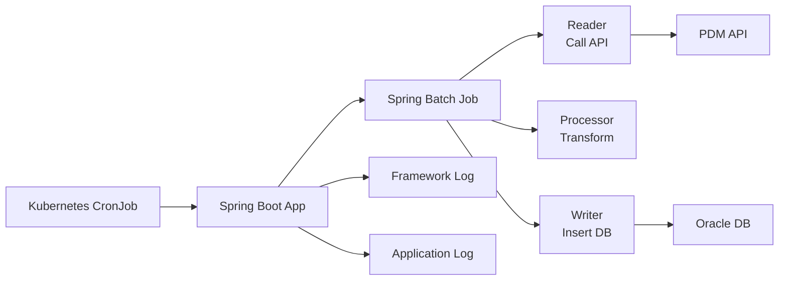
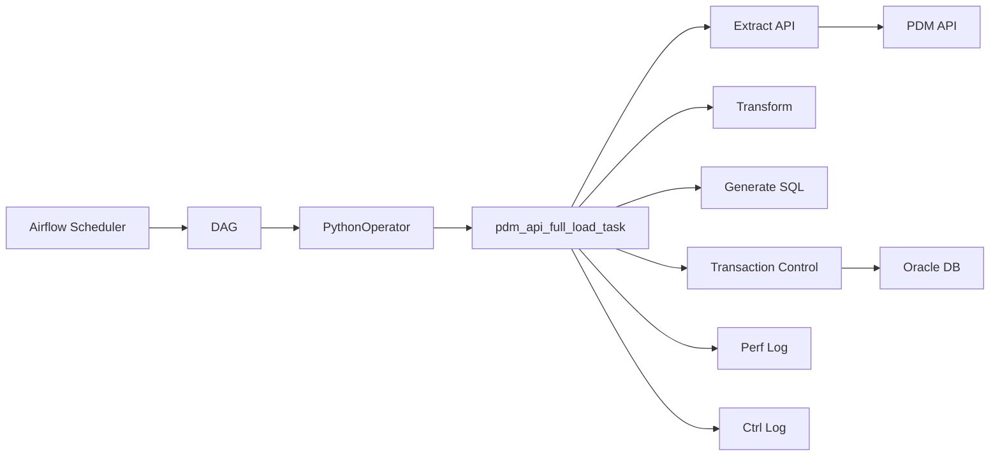
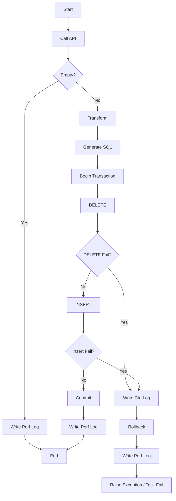

# 1. 背景與任務目標

本次任務的目標，是將既有 `PQO-PDMEtl` 系統中的 ETL 流程，  
由原本的 **Spring Batch 應用**，重構為 `PQO-batch` repository 中的 **Airflow DAG 任務**。

此次重構的核心，不只是將語言從 Java 改為 Python，  
而是將 ETL 的執行模式由：

```text
應用程式導向（Application-oriented）
```

轉為：

```text
排程導向（Workflow-oriented）
```

也就是將 ETL 從一個需獨立部署與維護的 Spring Boot 批次程式，  
轉型為 Airflow 中可被排程、監控、重試與管理的資料處理流程。

---

## 1.1 任務範圍

本次重構涵蓋以下三個 ETL：

- `TI_PROC_OPT`
- `TI_RAW_WAFER_QUES`
- `TI_WF_OPT_CATG`
    

資料來源皆為 **PDM API**，目標端為 **Oracle DB**。

---

## 1.2 ETL 流程概念

```text
PDM API → Transform → Oracle DB
```

本次 ETL 的共同特性如下：

- 每次由 API 全量取得資料
- 資料量小
- 採 Full Load 策略
- 目標為整批成功或整批 rollback
- 不需複雜 partition / parallel / incremental load

---

## 1.3 本次分享重點

本次分享將說明以下內容：

- 原有 Spring Batch 架構與限制
- 重構動機與目標
- Airflow DAG 新架構與核心實作方式
- 重構後的效益與 trade-off

---

# 2. 原有系統設計（Spring Batch）

## 2.1 原系統整體架構

原系統 `PQO-PDMEtl` 為一個 Spring Boot + Spring Batch 專案，  
由 Kubernetes CronJob 定時啟動容器並執行 ETL。

整體流程如下：

```text
Kubernetes CronJob → Spring Boot App → Spring Batch Job → Oracle DB
```

---

## 2.2 專案結構

```text
src/main/java/com/tsmc/pqo/etl/cis/
├── batch/
│   ├── BatchConfig.java
│   ├── BatchDataSourceConfig.java
│   ├── JobCompletionNotificationListener.java
│   ├── TiProcOptProcessor.java
│   ├── TiProcOptReader.java
│   ├── TiProcOptWriter.java
│   ├── TiRawWaferQuesProcessor.java
│   ├── TiRawWaferQuesReader.java
│   ├── TiRawWaferQuesWriter.java
│   ├── TiWfOptCatgProcessor.java
│   ├── TiWfOptCatgReader.java
│   └── TiWfOptCatgWriter.java
├── model/
│   ├── jpa/
│   │   ├── TiProcOpt.java
│   │   ├── TiRawWaferQues.java
│   │   ├── TiRawWaferQuesPK.java
│   │   ├── TiWfOptCatg.java
│   │   └── TiWfOptCatgPK.java
│   └── to/
│       ├── TiProcOptTo.java
│       ├── TiRawWaferQuesTo.java
│       └── TiWfOptCatgTo.java
├── repository/
│   ├── TiProcOptDao.java
│   ├── TiRawWaferQuesDao.java
│   └── TiWfOptCatgDao.java
├── PDMConfig.java
├── PQOConfig.java
└── PqoPdmEtlApplication.java
```

---

## 2.3 Spring Batch 分層模式

每一個 ETL 任務都需要拆分為：

- Reader：呼叫 API 讀取資料
- Processor：進行欄位轉換與資料清洗
- Writer：透過 JPA 將資料寫入 Oracle
- BatchConfig：組裝 Step 與 Job

以 `TI_PROC_OPT` 為例，需要至少包含：

- `TiProcOptReader`
- `TiProcOptProcessor`
- `TiProcOptWriter`

也就是一個相對簡單的 ETL，仍需拆成多個 class 才能完成。

---

## 2.4 原系統架構圖




---

## 2.5 原系統執行方式  
  
原系統由 Kubernetes CronJob 定時觸發，啟動 Spring Boot 容器後執行 Spring Batch Job。  
其執行流程如下：  
  
1. **Kubernetes CronJob 觸發**  
由 `cronjob.yaml` 定義排程時間，並透過 `java -jar` 啟動 `PQO-PDMETl.jar`  
  
2. **Spring Boot 啟動 Application Context**  
由 `PqoPdmEtlApplication.java` 作為入口，載入整個 Spring application  
  
3. **初始化外部資源與 Batch 元件**  
主要完成以下初始化：
- `PDMConfig.java`：建立 PDM API WebClient  
- `PQOConfig.java`：建立 Oracle DataSource / JPA / TransactionManager  
- `BatchConfig.java`：組裝 Job / Step / Reader / Processor / Writer  
  
4. **執行 Spring Batch Job**  
依 `BatchConfig.java` 中定義的 Step 流程執行 Reader → Processor → Writer  
  
5. **Job 完成後記錄狀態並結束程式**  
由 `JobCompletionNotificationListener.java` 在 Job 結束後記錄完成或失敗狀態

### 2.5.1 Job 執行模式  
  
在原 Spring Batch 架構中，系統中定義了多個 Job（對應不同 ETL 任務）。  
當 Spring Boot 啟動時，這些 Job 會由 Spring Batch 自動執行。  
  
- Job 之間預設為**同步（非平行）執行**  
- 執行順序由 Spring container 決定，未明確控制  
- 若其中一個 Job 執行失敗，在發生未處理 exception 時，可能導致整個 application 結束，後續 Job 無法執行  
  
也就是說，原系統中的多個 ETL Job 並非彼此獨立，而是綁定在同一個 application process 中執行。

### 2.5.2 Transaction 行為補充  

在本專案中，`PQOConfig.java` 定義了：  
  
```java  
@Bean("pqoTransactionManager")  
public PlatformTransactionManager pqoTransactionManager(  
        @Qualifier("pqoEntityManagerFactory") EntityManagerFactory entityManagerFactory) {  
  
    JpaTransactionManager transactionManager = new JpaTransactionManager();  
    transactionManager.setEntityManagerFactory(entityManagerFactory);  
      
    return transactionManager;  
}
```

因此，當 Step 執行過程中發生 exception 時，Spring Batch 會自動 rollback 該 transaction。

然而，本專案原有設計中，`deleteAll()` 是在 Reader 的 `@PostConstruct` 初始化階段執行，  
而非在 Step 的 transaction 內部執行，例如：

``` java
@PostConstruct  
public void init() {  
    ...  
    if (!CollectionUtils.isEmpty(opts)) {  
        dao.deleteAll();  
    }  
}
```

這代表：

- `deleteAll()` 與後續的 insert 並不一定在同一個 transaction 中
- 若後續寫入失敗，可能出現「資料已刪除，但新資料未成功寫入」的風險

也就是說，原系統中的 delete 與 insert 並不具備完整原子性（atomicity），存在資料不一致的風險。

---

# 3. 原系統設計特性與實際使用情境

## 3.1 Spring Batch 的典型能力

Spring Batch 主要針對大批次資料處理設計，常見能力包括：

- chunk-based transaction（分批 commit）
- retry / skip 機制（容錯處理）
- partition / parallel（將資料分批並行處理，以提升大量資料處理效率）

=> 適用於以下情境：

- 資料量大
- 執行時間長
- 允許部分資料失敗的批次任務
---

## 3.2 Chunk-based Transaction 概念

Spring Batch 通常會用 chunk 為單位處理資料，例如：

```java
stepBuilderFactory.get("step")
    .<Input, Output>chunk(100)
    .reader(reader)
    .processor(processor)
    .writer(writer)
    .build();
```

執行概念如下：

```text
讀100筆 → 處理100筆 → 寫入100筆 → commit
```

這種設計適合：

- 資料量大
- 單一 transaction 不宜過大
- 允許部分 chunk 成功、部分 chunk 失敗

但在本專案中，由於資料量小且單次 API 可取得完整資料，因此 chunk-based transaction 的價值有限。

---

## 3.3 Retry / Skip 機制
  
  Spring Batch 也提供 fault-tolerant 機制，可針對特定 exception 設定 retry 或 skip 行為。

```java
stepBuilderFactory.get("step")  
.<Input, Output>chunk(100)  
.reader(reader)  
.processor(processor)  
.writer(writer)  
.faultTolerant()  
.retry(Exception.class)  
.retryLimit(3)  
.skip(Exception.class)  
.skipLimit(10)  
.build();
```

### 行為說明

當 Reader / Processor / Writer 在處理 item 時發生符合設定的 exception，Spring Batch 可依設定進行以下處理：

1. **Retry 機制**
    - 若 exception 符合 `retry(...)` 設定
	- 則依 `retryLimit(...)` 設定的上限進行重試
2. **Skip 機制**
    - - 若 retry 後仍無法成功
	- 且 exception 符合 `skip(...)` 設定
	- 且累計 skip 次數未超過 `skipLimit(...)`
	- 則略過該 item，繼續處理後續資料
3. **Skip Limit**
    - - 若 exception 不符合 retry / skip 條件
	- 或 skip 次數超過 `skipLimit(...)`
	- 則 Step fail

---

### 設計目的

此機制適用於以下情境：

- 資料量大
- 個別資料可能有問題（dirty data）
- 業務上可接受少數資料被略過
- 不希望單筆錯誤導致整個批次立即中止

然而，在本專案中並未採用此機制，而是選擇整批成功或整批 rollback 的策略。

也就是說，本專案不希望出現「部分資料成功、部分資料被 skip」的結果，因此 retry / skip 雖然是 Spring Batch 的重要能力，但並不符合本專案的資料一致性需求。

---

## 3.4 差異分析

綜合上述，將 Spring Batch 提供的能力與本專案需求對照如下：

|Spring Batch 提供能力|本專案實際需求|
|---|---|
|chunk 分批 commit|單一 transaction 即可|
|retry / skip|採整批 rollback|
|partition / parallel|資料量小，不需要|

=> 可以觀察到，大部分 framework 提供的能力，在本專案中並未被使用。

---

## 3.5 小結

Spring Batch 本身沒有問題，但對本專案而言，出現了：

> **框架能力大於實際需求**

也就是：

- 為了支援大批次處理與容錯能力，引入較多抽象層
- 但實際需求僅為簡單 ETL 流程

本專案實際特性為：

- 資料量小
- 無需 retry / skip
- 單一 transaction 即可完成

=> 因此，整體架構相對過重，並增加了維護成本。

---

# 4. 重構動機與目標

## 4.1 重構動機

本次重構主要有以下幾個動機。

### (1) 架構與需求不匹配

本專案流程本質上非常直接：

```text
Call API → Transform → Insert DB
```

但實作上卻使用了較重的 Spring Batch 分層模式，  
導致一個簡單流程需拆成 Reader / Processor / Writer 多個 class。

---

### (2) Log 冗餘與可觀測性問題

原架構中：

- Framework log 與 application log 混雜
- 缺乏統一的任務監控與視覺化介面

這使得 troubleshooting 成本較高。

---

### (3) Spring Boot 生態維護成本高

原系統依賴：

- Spring Boot
- Spring Batch
- JPA
- JDBC
- 多個 config 與 deployment 組件

當版本升級或 CI pipeline 發生相依問題時，維護成本相對高。

---

## 4.2 重構目標

本次重構希望達成以下目標：

| 目標     | 說明                                            |
| ------ | --------------------------------------------- |
| 降低維護成本 | 移除 Spring Boot / Batch 依賴，減少升版與 CI 維護負擔       |
| 簡化架構   | 讓 ETL 更貼近 「API → Transform → DB」 的實際流程        |
| 提升可觀測性 | 透過 Airflow UI 統一查看 task 狀態與 log               |
| 統一排程管理 | 將 scheduling / retry / monitoring 集中至 Airflow |
| 提升可擴充性 | 抽出共用 ETL framework，未來可快速複用                    |

---

## 4.3 架構轉變

### Before

```text
CronJob → Spring Boot → Batch → DB
```

### After

```text
Airflow DAG → Python Task → DB
```

這個改變的本質是：

> ETL 不再需要透過啟動一個完整的應用程式來執行，  
而是直接作為 Airflow workflow 中的一個 task，由既有的排程系統負責觸發與執行。

---

# 5. 新系統架構（Airflow DAG）

## 5.1 新系統整體架構

重構後的 ETL 被整合至 `PQO-batch` repository 中，  
由 Airflow DAG 直接進行排程與執行。

整體流程如下：

```text
Airflow Scheduler → DAG → PythonOperator → Oracle DB
```

---

## 5.2 新系統專案結構

```text
app/
└── dags/
    ├── etl_ti_proc_opt.py
    ├── etl_ti_raw_wafer_ques.py
    ├── etl_ti_wf_opt_catg.py
    ├── pdm_api_etl_utils/
    │   ├── pdm_api_full_load.py
    │   ├── sql_utils.py
    │   └── __init__.py
    ├── schemas.py
    ├── utils.py
    └── __init__.py
```

各個檔案內容如下：
### `etl_ti_proc_opt.py`

此檔案負責定義一個完整的 ETL DAG，其內容可拆為四個部分：  
  
1. **Schedule（排程）**  
- 定義於 DAG 物件中  
- 控制 ETL 執行時間（cron expression）  
```python
dag_ti_proc_opt = DAG(  
"ETL_PQO_TI_PROC_OPT",  
...  
schedule="45 1-23/2 * * *",  
)
```
  
2. **Task（任務）**  
- 使用 PythonOperator 定義  
- 指定執行的核心 ETL function（pdm_api_full_load_task） 
```python
etl_full_load_task = PythonOperator(
    task_id="etl_ti_proc_opt_full_load",
    python_callable=pdm_api_full_load_task,
    op_kwargs={ ... }
)
```
  
3. **Transform Logic（資料轉換）**  
- 由 `_process_ti_proc_opt_data` 實作  
- 負責資料清洗與欄位轉換  
  
4. **SQL Generation Logic（SQL 組裝）**  
- 由 `_generate_ti_proc_opt_insert_sql` 實作  
- 將資料轉換為 INSERT SQL

### `pdm_api_etl_utils/pdm_api_full_load.py`

此檔案為本次重構的核心 framework，負責：

- 呼叫 PDM API
- 將資料轉為 DataFrame
- 執行 transform
- 產生 INSERT SQL
- 控制 DELETE + INSERT transaction
- 寫入 ETL control / performance log


---

## 5.3 新系統架構圖




---

# 6. 核心實作方式

## 6.1 一表一 DAG

本次設計採用：

```text
一張表對應一個 DAG
```

對應關係如下：

- ETL_PQO_TI_PROC_OPT <-> TI_PROC_OPT
- ETL_PQO_TI_RAW_WAFER_QUES <-> TI_RAW_WAFER_QUES
- ETL_PQO_TI_WF_OPT_CATG <-> TI_WF_OPT_CATG

此設計的好處是：

- 可獨立 rerun，失敗隔離清楚
- 未來若需調整 schedule 或 retry，可單獨處理

---

## 6.2 共用 ETL Framework

本次不是將三個 ETL 各自獨立重寫，  
而是抽出共用的 `pdm_api_full_load_task()` 作為 ETL framework。

其流程如下：

```text
Extract → Transform → Generate SQL → DELETE → INSERT → Logging
```

這樣的好處是：

- 共同行為集中管理
- 每個 DAG 只需關注 table-specific 的差異
- 後續新增同類型 ETL 時，可降低重複開發成本

---

## 6.3 Full Load + Atomic Transaction

本次沿用既有 ETL 邏輯，採用 Full Load 策略：

1. 先刪除目標表舊資料
2. 再插入 API 新資料
3. 任一步驟失敗則 rollback
4. 全部成功才 commit


這個設計確保資料表不會出現：

- 刪除成功但插入不完整
- 部分資料寫入成功、部分失敗的中間狀態

---

## 6.4 Airflow Retry 機制

相較於原本 Spring Batch 專案未明確使用 retry / skip，  
新的 Airflow 版本在 task level 設定了 retry：

- `retries=5`
- `retry_delay=10 seconds`
- `retry_exponential_backoff=True`
- `max_retry_delay=5 minutes`
    

這使得暫時性問題（例如 API 短暫異常）可以由 Airflow 自動重試。

---

## 6.5 ETL 控制與績效記錄

本次 ETL 整合了既有 `PQO-batch` 專案中的兩張 log table：

### `PQO_SYS_ETL_PERF_LOG`

用途：記錄整個 ETL 的執行情況

- ETL 名稱
- 開始 / 結束時間
- 總筆數
- 失敗筆數
- 執行狀態

### `PQO_SYS_ETL_CTRL_LOG`

用途：記錄錯誤細節

- ETL 名稱
- 失敗資料 key
- 目標表
- 錯誤碼
- 錯誤訊息

這使得 ETL 任務除了 Airflow log 外，也能保留資料庫層級的控制與追蹤資訊。

## 6.6 執行流程總結

流程如下：




---

# 7. 設計亮點與實際收益

## 7.1 架構簡化

重構後移除了以下元件：

- Spring Boot application
- Spring Batch Job / Step 組裝
- Reader / Processor / Writer class 拆分
- JPA entity / repository dependency

ETL 流程更貼近實際需求本身。

---

## 7.2 維護成本下降  
  
在 Airflow 架構下，ETL 任務從「應用程式」轉為「DAG」，帶來以下維護上的簡化：  
  
- 不再依賴完整的 Spring Boot 生態（Batch / JPA / JDBC），降低框架升版與相依性問題  
- 減少 framework configuration（如 DataSource、TransactionManager）所帶來的複雜度  
- ETL 的 release unit 從 application 轉為 DAG，部署與排程管理更集中  
- CI / deployment 仍需維護，但重點從建置完整 Java 應用程式，轉為驗證與部署 DAG / Python 邏輯，整體流程較為輕量

---

## 7.3 可觀測性提升

透過 Airflow UI，可以直接觀察：

- DAG run 狀態
- task success / failed
- retry 歷史
- 執行 log

新架構在 troubleshooting 上更直覺。

---

## 7.4 可擴充性提升

新架構的共用 framework 使未來若有更多類似：

```text
PDM API → Full Load → Oracle
```

的 ETL，可以快速複製與擴展。

---

## 7.5 Failure Isolation（失敗隔離）  
  
在原 Spring Batch 架構中，多個 ETL Job 綁定在同一個 Spring Boot application 中執行。  
若其中一個 Job 發生 exception，可能導致整個 application 中斷，進而使後續 Job 無法執行。  
  
也就是說，原系統中的多個 ETL 任務彼此之間存在一定程度的耦合。  
  
而在 Airflow 架構下：  
  
- 每個 ETL 為獨立 DAG  
- 任務失敗僅影響該 DAG  
- 不會阻斷其他 ETL 任務執行  
  
此設計提升了系統穩定性，也降低了單一任務失敗對整體排程的影響範圍。

---

# 8. Trade-off 與設計取捨

重構並不代表所有問題都消失，而是基於目前需求與情境，選擇最合適的設計。

---

## 8.1 SQL 執行策略：row-by-row

目前採用逐筆執行 INSERT SQL 的方式。

### 選擇原因

- 資料量小（<300 筆）
- 邏輯直觀
- 易於記錄單筆錯誤
- 可直接整合 control log

### Trade-off

- DB round trip 次數較多
- 當資料量成長時，效能可能下降

### 未來優化方向

若資料量顯著增加，可考慮：

- batch insert
- parameterized SQL
- executemany

以降低 DB 負載並提升執行效率。

---

## 8.2 資料同步策略：Full Load

本次採用：

```
DELETE + INSERT
```

而非 incremental load。

### 選擇原因

- API 僅提供全量資料（無變更追蹤機制）
- 邏輯簡單
- 容易保證資料一致性
- 可搭配 transaction 確保「全成功或全 rollback」

### Trade-off

- 當資料量變大時，DELETE + INSERT 成本提高
- 執行時間可能增加

### 未來優化方向

若未來：

- API 提供 update timestamp
- 或資料量顯著增加

可考慮改為 incremental load（upsert / merge），以降低資料處理成本。

---

## 8.3 DAG 設計：單 task 模式

目前每個 DAG 僅包含一個 PythonOperator，負責完整 ETL 流程。

### 選擇原因

- 流程單純（單一 API → 單一 table）
- 無中間層或多階段依賴
- 可維持 transaction 一致性
- 降低 DAG 複雜度

### Trade-off

- 可觀測性較低（無法細分每個階段）
- 無法針對單一階段 rerun
- log 集中於單一 task

### 未來優化方向

例如當 ETL 不再只是單純搬資料，而是需要加入前處理、後處理或品質控管時：

- data validation
- stage table
- downstream notification
- data quality checks

可進一步拆分為多個 task（extract / transform / load / notify），以提升：

- 可觀測性（observability）
- 錯誤隔離能力
- DAG orchestration 能力

---

# 9. 重構前後比較

| 項目           | Spring Batch 版本                  | Airflow DAG 版本                    |
| ------------ | -------------------------------- | --------------------------------- |
| 執行模式         | CronJob 啟動應用程式                   | Airflow 直接執行任務                    |
| 技術棧          | Java / Spring Boot / Batch / JPA | Python / Airflow                  |
| 架構複雜度        | 較高                               | 較低                                |
| 維護成本         | 較高                               | 較低                                |
| 可觀測性         | 分散                               | 集中                                |
| retry 管理     | 不明確                              | Airflow 內建                        |
| release unit | 分散                               | 集中於 batch repo                    |
| 擴充方式         | 新增 Reader / Processor / Writer   | 新增 DAG + transform / SQL function |


